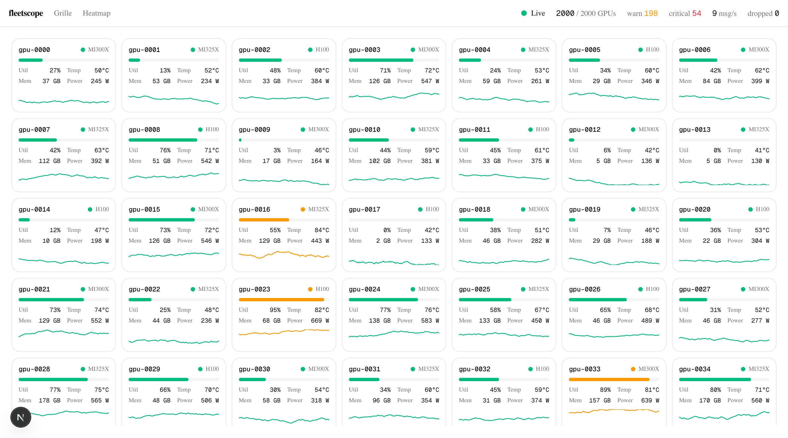
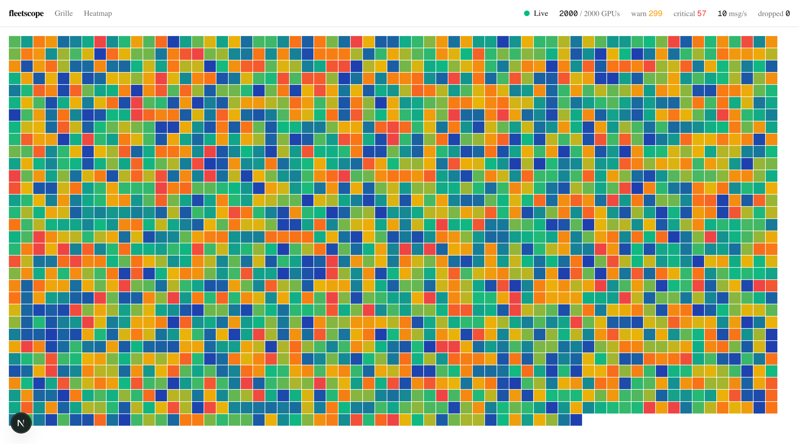

# fleetscope

**Dashboard de télémétrie GPU temps réel — construit pour stress-tester le state React haute fréquence, le streaming WebSocket et le rendu haute densité.**

Un serveur simule une fleet de GPU et pousse leurs métriques (utilisation, température,
mémoire, puissance) en continu. Le front les affiche en direct — de quelques dizaines à
quelques milliers de GPU — sans laguer.



## Pourquoi ce repo existe

Une étude délibérée des parties *dures* des UI temps réel, traitées chacune en
**avant → après** : on construit le problème, on le mesure (React Profiler / trace
Performance), puis on le corrige. Quatre problèmes :

1. **State haute fréquence** — un flux qui flood l'UI fait re-render tout l'arbre.
2. **Streaming temps réel** — WebSocket, reconnexion, backpressure, batching.
3. **Rendu haute densité** — afficher des milliers d'éléments live sans jank.
4. **Dataviz bas niveau** — canvas 2D quand le SVG/DOM s'écroule.

## Architecture

```
┌────────────────┐   ws (10–20 Hz)   ┌──────────────────────────────┐
│  server/ (ws)  │ ──── delta ─────▶ │ use-telemetry-socket          │
│  simulateur    │   snapshot/hello  │   buffer rAF → 1 commit/frame │
│  de fleet      │ ◀── reconnexion ─ │   backoff + Visibility API    │
└────────────────┘                   └──────────────┬───────────────┘
                                                     ▼
                                      ┌──────────────────────────────┐
                                      │ store Zustand (externe)       │
                                      │  latest · history · stats     │
                                      └───┬───────────────┬───────────┘
                          sélecteurs (useShallow)    subscribe transient
                                      ▼                       ▼
                          ┌────────────────────┐   ┌────────────────────┐
                          │ cards virtualisées  │   │ heatmap canvas      │
                          │ + Recharts          │   │ (0 render React)    │
                          └────────────────────┘   └────────────────────┘
```

## Les 4 leçons

> Chiffres mesurés en local (compteur de commits React, nœuds DOM, timing rAF) ;
> reproductibles en scalant la fleet par `NEXT_PUBLIC_FLEET_SIZE`.

| # | Problème | Symptôme | Fix | Résultat mesuré |
|---|----------|----------|-----|-----------------|
| 1 | State HF | Context re-render **toutes** les cards à chaque tick | Store Zustand + sélecteurs `useShallow` | commits de card **640/s → 113/s** (÷5.7 @64) — seules les cards changées re-render |
| 2 | Temps réel | `onmessage` hors batching React, reconnexions sauvages | Buffer rAF (1 commit/frame) + backoff/jitter + backpressure | reconnexion espacée **~1 s, 2 s, 4 s…** (jittée, capée 30 s) ; commits bornés à la fréquence d'écran |
| 3 | Haute densité | Des milliers de cards montées = jank au scroll | Virtualisation `@tanstack/react-virtual` + `React.memo` | @2000 GPU : **44 071 → 1 176 nœuds DOM** (÷37), scroll **~4 → ~85 fps** |
| 4 | Dataviz | SVG = 1 nœud DOM/cellule = navigateur à genoux | Canvas 2D piloté en lecture transient du store | @2000 cells : **0 render React** en régime établi, **120 fps** |

La heatmap canvas (1 rect/GPU, repeinte hors du cycle React via lecture transient du store) :



## Stack

Next 16 (App Router) · React 19 · TypeScript strict · Tailwind 4 · shadcn (Base UI) ·
Zustand 5 · @tanstack/react-virtual · Recharts 3 · canvas 2D + d3-scale · ws ·
Vitest (happy-dom) + Playwright (chromium).

## Démarrage

```bash
pnpm install
pnpm dev        # Next (:3000) + serveur WS (:4000) via concurrently
```

Ouvrir http://localhost:3000/fleet.

Pour les démos perf, scaler la fleet et le débit par env :

```bash
NEXT_PUBLIC_FLEET_SIZE=2000 NEXT_PUBLIC_TICK_HZ=20 pnpm dev
```

## Tests

```bash
pnpm test:run        # unit (Vitest) : parser Zod, backoff, ring-buffer, sélecteurs, store
pnpm test:coverage   # couverture scopée à la logique pure
pnpm test:e2e        # smoke E2E (Playwright)
```

> L'E2E tourne contre un build de prod (`pnpm build && pnpm start`) : le runtime HMR de
> `next dev` (Turbopack) casse l'hydratation en chromium headless. La prod n'a pas de HMR.

## WebSocket vs SSE — pourquoi un process séparé

Les Route Handlers de Next déploient en serverless et ne peuvent pas tenir une connexion
WebSocket persistante. Le pattern correct : **Next pour l'UI + un process séparé pour les
sockets**. Si le flux était unidirectionnel, un SSE depuis un Route Handler suffirait — mais
le WebSocket bidirectionnel avec un vrai handshake et de la backpressure est précisément la
compétence visée ici.

## Roadmap

- [ ] Agrégation / clustering côté serveur (résumés par rack)
- [ ] `WebSocketStream` (backpressure pull-based)
- [ ] Heatmap WebGL pour 100k+ GPU
- [ ] Variante transport gRPC-web

---

_Projet perso — [selmene.dev](https://selmene.dev)._
